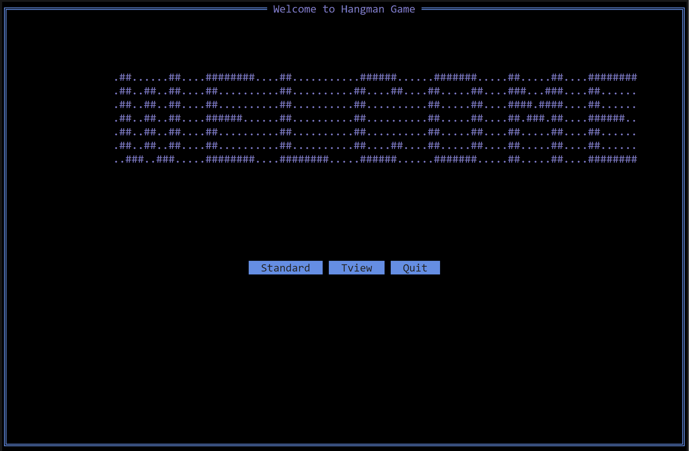

# Hangman 🪢

Welcome to Hangman ! This project is based on the famous HangMan Game



# Prerequisite :rewind:

Somes knowledges in this field : 

- The use of Golang 
- The use of Git and for the code management

# Installation :wrench:

1. Clone the repository.
```bash
  git clone https://ytrack.learn.ynov.com/git/mkilian/Hangman.git
```
2. Reach in the repository.
```bash
  cd Hangman
```

# Start :technologist:

1. Write this command : 
```bash
  go run main/main.go words.txt
```
2. You can change the words.txt among words.txt words2.txt or words3.txt

3. You can choose between the standard game and the tview game

# How Play ? :hammer:

Let’s name José the poor man that will be hanging to this rope if you lose.

The aim is to find the word that the computer chose. The player can suggest either a word or a letter among the 26 letters of the alphabets to find the word. You can't use 2 times the same letters and you will have 10 attempts to complete the game. When the player suggest a word, if the word is found the game stops, if not, the counter of attempts decrease by 2.
The program continues until the word is either found, or the numbers of attempts is 0. 

If you want to stop the game the player has to write "STOP" in the input. It will save the game. If the player want to continue the game, write this command :
```bash
  go run main/main.go --startWith save.txt
```
That allow you to launch the game with the file you saved before.

If you want to play with ASCII Art you can write this command :
```bash
  go run main/main.go --letterFile standard.txt  words.txt
```
You can choose ASCII file among shadow.txt standard.txt or thinkertoy.txt and choose a word file among words.txt words2.txt or words3.txt.

WARNING: If the ASCII art is poorly displayed, that's because of the length of the screen. Try to play on standard game

# Version :card_file_box:

golang 1.21.0

# Auteurs :money_with_wings:

 - [Kilian Moun :beers:](https://github.com/MounKilian)